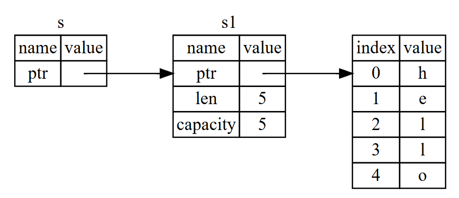

# References and Borrowing

For avoiding the overhead of copying and moving data around, `Rust` has a feature called `references`, similar to references in `C++`.

## Table of Contents

1. [The Rules of References](#the-rules-of-references)
2. [What is Reference and Borrowing?](#what-is-reference-and-borrowing)
3. [Mutable References](#mutable-references)
4. [Dangling References](#dangling-references)


## The Rules of References

1. At any given time, we can have either `one mutable` reference or `any number of immutable` references.
2. References must always be `valid` (i.e., point to a valid value).


## What is Reference and Borrowing?

These `references` can be interpreted as a `pointer` to a value in memory. That data is `owned` by another variable, and the `reference` allows us to `borrow` that data momentarily.

Unlike `pointers` in `C++`, `Rust` has a strict set of rules that the `references` must follow. For example, a `reference` cannot outlive the variable it is borrowing from, so, unlike `pointers`, it always points to valid data.

These rules are enforced at compile time, so there is no overhead at runtime.

```rust
fn main() {
    let s1 = String::from("hello");  // 's1' comes into scope
    let len = calculate_length(&s1); // 's1' is borrowed, not moved
                                     // 'len' comes into scope

    // both 's1' and 'len' are still valid here
    println!("The length of '{}' is {}.", s1, len);
}

// 's' is a reference to a String
fn calculate_length(s: &String) -> usize {
    return s.len();
} // 's' goes out of scope, but does not have ownership of what it refers to
```

For the piece of code above, the `calculate_length` function takes a `reference` to a `String` as a parameter. This is called `borrowing`.

<p align="center">
    
</p>

`NOTE:` By default, the use of `references`, or `&`, is `immutable`. This means that the data cannot be changed through the reference. It is similar to the behavior of `const type&` in `C++`.

<div style="display: flex;">
<div style="margin-right: 20px;">

```rust
fn calculate_length(s: &String) -> usize {
    return s.len();
}
```

</div>
<div>

```c++
size_t calculate_length(const std::string& s) {
    return s.length();
}
```

</div>
</div>


## Mutable References

If we want to change the data that the reference points to, we can use a `mutable reference`. This is done by using `&mut` instead of `&`.

```rust
fn main() {
    let mut s = String::from("hello");  // 's' comes into scope
    change(&mut s);                     // 's' is borrowed as mutable
                                        // 's' is still valid here

    println!("{}", s);                  // 's' is still valid here
                                        // 'hello, world' is printed
}

fn change(s: &mut String) {
    s.push_str(", world");
}
```

For the ones more familiar with `C++`, like me, this is similar to the behavior of `type&` in `C++`.

<div style="display: flex;">
<div style="margin-right: 20px;">

```rust
fn change(s: &mut String) {
    s.push_str(", world");
}
```

</div>
<div>

```c++
void change(std::string& s) {
    s += ", world";
}
```

</div>
</div>

`NOTE:` We can have only one `mutable reference` to a particular piece of data in a particular scope. This is to prevent data from being changed in multiple places at the same time, which can cause `data races`.


## Dangling References

`Dangling references` are a common bug in other programming languages, but not in `Rust`. The compiler will ensure that all references are always `valid`.

If we have a `reference` to some data, the compiler will ensure that the `data` will not go out of scope `before the reference` does.

```rust
fn main() {
    let reference_to_nothing = dangle();
}

fn dangle() -> &String {                 // Returns a reference to a String
    let s = String::from("hello");       // 's' comes into scope
    return &s;                           // 's' goes out of scope
}                                        // 's' is dropped, so now 'reference_to_nothing' is a dangling reference
```

`NOTE`: This covers a bit of the `lifetime` topic, which will be covered in more detail later on [chapter 10](../10_generic_types_traits_and_lifetimes/readme.md).

The "solution" here is simple: return the `String` directly, instead of a `reference`.

```rust
fn no_dangle() -> String {
    let s = String::from("hello");
    return s;
}
```
